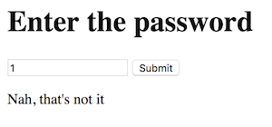
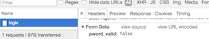
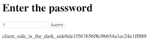

# PicoCTF_2017: Lazy Dev

**Category:** Master
**Points:** 50
**Description:**

>I really need to login to [this](http://shell2017.picoctf.com:35895/) website, but the developer hasn't implemented login yet. Can you help?

**Hint:**

>Where does the password check actually occur?
Can you interact with the javascript directly?

## Write-up
First, try attempting login.

Hm, ok, `1` is not the password. Let's try looking at Chrome's Developer's console.

Okay, so something is going on here... Can we try to change that `false` to a `true`? Taking a look into the [`client.js`](client.js) implemented into the HTML seems to reveal that the developer, was indeed lazy! _Badumtss~_

    //Validate the password. TBD!
    function validate(pword){
      //TODO: Implement me
      return false;

As such, there is no correct password! Let's override the function in Chrome's Trusty Developer's console again, by simply replacing false, with true.

    function validate(pword){
      //TODO: Implement me
      return true;
    }

Now, clicking the button again, gives us,

Therefore, the flag is, `client_side_is_the_dark_sidebde1f567656f8c9b654a1ec24e1ff889`. EZ Master.