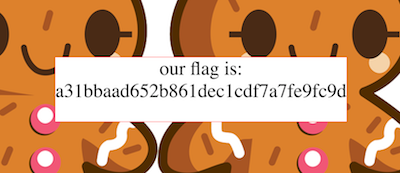

# PicoCTF_2017: Biscuit

**Category:** Web Exploitation
**Points:** 75
**Description:**

>Your friend has a personal website. Fortunately for you, he is a bit of a noob when it comes to hosting a website. Can you find out what he is hiding? [Website](http://shell2017.picoctf.com:46787/.

**Hint:**

>Viewing the source of the website is usually a good start.

## Write-up
Looking at source, we get 

    <html>

    <!-- Storing stuff in the same directory as your web server doesn't seem like a good idea -->
    <!-- Thankfully, we use a hidden one that is super PRIVATE, to protect our cookies.sqlite file -->
    

    <body >

    

    

    <form style="font-size: 40px; ">
    Access Denied</form>
    

    

    </body>

    </html>

Downloading `private/cookies.sqlite` gives us this nice [sqlite file](cookies.sqlite) and in it, we find a free cookie! Using Javascript to edit document.cookie, we get the flag!

    > document.cookie = "ID=F3MAqpWxIvESiUNLHsflVd"
    

Therefore, the flag is `a31bbaad652b861dec1cdf7a7fe9fc9d`.