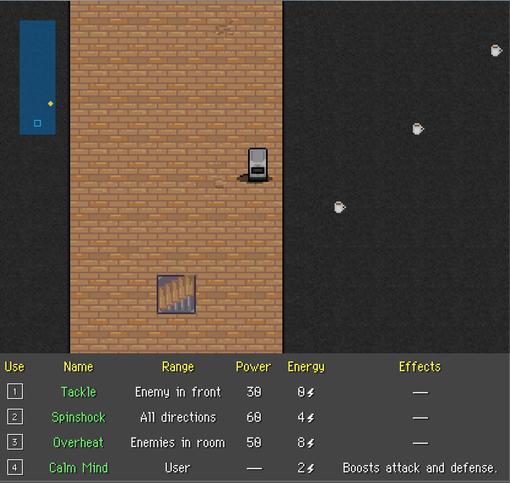
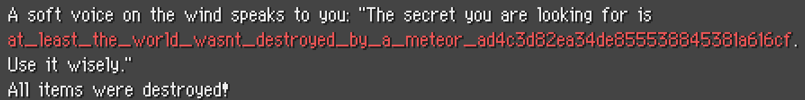

# PicoCTF_2017: TW_GR_E1_ART

**Category:** Web Exploitation
**Points:** 100
**Description:**

>Oh, sweet, they made a spinoff game to Toaster Wars! That last room has a lot of flags in it though. I wonder which is the right one...? Check it out [here](http://shell2017.picoctf.com:16929/).

**Hint:**

>I think this game is running on a Node.js server. If it's configured poorly, you may be able to access the server's source. If my memory serves me correctly, Node servers have a special file that lists dependencies and a start command; maybe you can use that file to figure out where the other files are?

## Write-up
All NodeJS servers generally depend on dependencies(_hah!_). Let's try accessing `http://shell2017.picoctf.com:16929/package.json`.

    {
      "name": "rogue-1",
      "version": "1.0.0",
      "main": "server/serv.js",
      "dependencies": {
        "beautiful-log": "^1.3.0",
        "body-parser": "^1.16.0",
        "callsite": "^1.0.0",
        "clone": "^2.1.0",
        "colors": "^1.1.2",
        "cookie-parser": "^1.4.3",
        "deep-diff": "^0.3.4",
        "dequeue": "^1.0.5",
        "express": "^4.14.1",
        "mongodb": "^2.2.25",
        "morgan": "^1.7.0",
        "nconf": "^0.8.4",
        "promise": "^7.1.1",
        "socket.io": "^1.7.2",
        "sprintf": "^0.1.5"
      },
      "devDependencies": {},
      "scripts": {
        "prestart": "node server/init.js",
        "start": "node server/serv.js"
      }
    }

Interesting. Let's try looking at `http://shell2017.picoctf.com:16929/server/init.js`

    var mongo   = require("mongodb").MongoClient;
    var nconf   = require("nconf");

    nconf.argv().env();

    let db;

    mongo.connect(`mongodb://localhost:27017/blundertale`)
        .then((d) => {
            db = d;
            return db.authenticate(nconf.get("MONGO_USER"), nconf.get("MONGO_PASS"));
        })
        .then(() => {
            return db.createCollection("games");
        })
        .catch((err) => {
            console.error("[DB] DB connection failed", err);
        })
        .then(() => {
            db.close();
        });

Is this database I am seeing? What's this `nconf`? Let's take a look at `http://shell2017.picoctf.com:16929/server/serv.js`.

    var express     = require("express");
    var app         = express();

    app.use(require("body-parser").json());
    app.use(require("cookie-parser")());
    // app.use(require("morgan")("dev"));

    var http        = require("http").Server(app);
    var path        = require("path");
    var fs          = require("fs");
    var Promise     = require("promise");
    var logger      = require("./logger");
    var sprintf     = require("sprintf");
    var nconf       = require("nconf");
    var db          = require("./db");
    var io          = require("socket.io")(http);

    require("./game")(app, io);

    nconf.argv().env();

    var PORT = nconf.get("port") || 8888;

    app.get("/", function(req, res){
        res.status(200);
        res.sendFile(path.join(__dirname, "../public/html/index.html"));
    });

    app.use(express.static(path.join(__dirname, "..")));

    http.listen(PORT, function(){
        logger.info("[server] Listening on *:" + PORT);
    });

    process.on("unhandledRejection", (err) => {
        logger.error(err.stack);
    });

Let's try looking into `game.js`

                case "revealFlag":
                    if (entity.items[action.item].effects[i].check == 64) {
                        outcome.flag = process.env["PICO_CTF_FLAG"];
                    }
                    break;

What's this? If `.check` is 64, we get the flag? Let's take a look at the [config.js](http://shell2017.picoctf.com:16929/server/config.js).

    function createFlag(check, location) {
        return {
            name: "Flag",
            description: "Gives you the flag... maybe.",
            location: location,
            use: 0,
            id: check + 100,
            sprite: "flag",
            effects: [
                {
                    type: "revealFlag",
                    check: check
                },
                {
                    type: "destroyItems"
                }
            ]
        };
    }
    ...
    items: Array.from(new Array(83), (_, idx) => {
        if (idx >= 2) {
            idx++
        }

        if (idx >= 77) {
            idx++;
        }

        var r = Math.floor(idx / 5) + 1;
        var c = (idx % 5) + 1;

        return createFlag(idx, { r: r, c: c });
    }),

Look like a flag's `.check` value is only `64` when `idx` is 64. `r` and `c` seems to correspond with coordinates on the map. Let's try to calculate the coordinate of the flag when `idx` is 64.

    var r = Math.floor(64 / 5) + 1;
    var c = (64 % 5) + 1;

Therefore, `r` is `13` and `c` is `5`. Let's try to plot this on a map.
     
    [ -4,  -3,  -3,  -3,  -3,  -3,  -2],
    [ -5,   1,   1,   1,   1,   1,  -1],
    [ -5,   1,   1,   1,   1,   1,  -1],
    [ -5,   1,   1,   1,   1,   1,  -1],
    [ -5,   1,   1,   1,   1,   1,  -1],
    [ -5,   1,   1,   1,   1,   1,  -1],
    [ -5,   1,   1,   1,   1,   1,  -1],
    [ -5,   1,   1,   1,   1,   1,  -1],
    [ -5,   1,   1,   1,   1,   1,  -1],
    [ -5,   1,   1,   1,   1,   1,  -1],
    [ -5,   1,   1,   1,   1,   1,  -1],
    [ -5,   1,   1,   1,   1,   1,  -1],
    [ -5,   1,   1,   1,   1,   1,  -1],
    [ -5,   1,   1,   1,   1, flag, -1],
    [ -5,   1,   1,   1,   1,   1,  -1],
    [ -5,   1,   1,   1,   1,   1,  -1],
    [ -5,   1,   1, stair, 1,   1,  -1],
    [ -5,   1,   1,   1,   1,   1,  -1],
    [ -6,  -7,  -7,  -7,  -7,  -7,  -8]

Navigating to the coordinate on the map gets us a flag that when used, gives us the flag.

